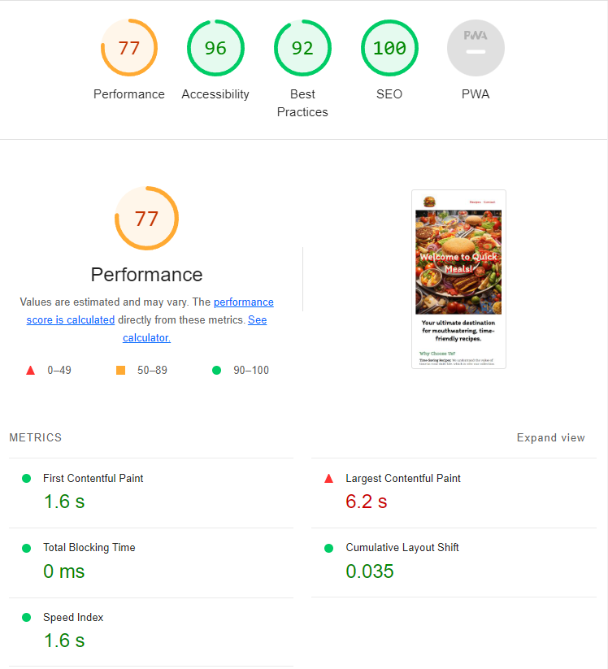

# Quick Meals

## User-Centric Frontend Development Milestone Project.

**Quick meals** is a fictitious website meant to give its users information about recipes which are very easy to cook in 20 minutes. The site will be targeted towards foodies who want to have a quick snack and don't need to do a lot of groceries.

### Existing Features

- **Navigation bar**

  - Featured on all three pages, the full responsive navigation bar includes links to the Main page, Recipes dropdown menu, and Contact page and is identical everywhere in order to allow easy navigation.
  - This section will allow users to easily navigate from page to page across all devices without having to revert back to the previous page via the ‘back’ button.

- **Smiley face**

  - This feature is destined to give a good emotion to users when they are hovering over the items in the Recipe dropdown menu.
  - It is meant to give users the feeling that they will satisfy their appetite if they will go to the respective pages.

- **Landing page image**

  - The landing page includes a photograph with text overlay to tell the user that this website is all about food and ingredients.
  - This section introduces users to a high quality image and an animation that gives the text a shadow slowly.

- **Why Choose Us section**

  - This section is meant to give users information about the main issues that the website is trying to solve.

- **Quick favorites section**

  - This section is an eye catcher for users, showing the end result of the recipe.
  - In case users have a hard time deciding on a meal, this section might solve that issue.
  - It gives users an option to jump to the recipe pages of some favorite quick picks.
  - It is another option of navigating to other pages.

- **The Footer**

  - The footer section includes links to the relevant social media sites for Quick Meals. The links will open to a new tab to allow easy navigation for users.
  - The footer is valuable to users as it encourages them to keep connected via social media.

- **Recipe Page**

**Description Section** - Consists of picture of a dish of choice, a catchy phrase in order to grab users's atention and pictures of the five ingredients they need to prepare it.

**Recipe Section** - Contains information about the steps users need to take in order to prepare the meal.

**Video Guide Section** - Gives users a tutorial video that they can follow along.

- **Contact Page**
- Contains a feedback form for users.
- Users can use this feature in order to send a message of what they think about the website, ideas for features that they would like to see or even some recipes they would like to share.

## Technologies used

### HTML5

- As a structure language.

### CSS3

- As style language.

### Font Awesome

- As an icon library for social links.

### GitHub

- As a software hosting platform to keep the project in a remote location.

### Git

- As a version-control system.

## Testing

I used Mozilla web developer tools and Chrome developer tools throughout the project for testing and solving problems with responsiveness and style issues.

Website was tested across multiple virtual devices and browsers with the help of the developer tools. I checked all supported devices and all the features are behaving and showing according to the screen size.

I also tested the website on my personal hardware: Xiaomi 12 pro that runs on Android 13.

### Performance Testing

I used [Lighthouse](https://developer.chrome.com/docs/lighthouse/overview/) tool to check performance of the website and these are the results.

The biggest issues where related to performance and it was because I wasn't using an optimal format for images. As a solution I converted all of the images into **WebP**.

### Validator Testing

- W3C CSS Validator to validate CSS
- W3C validator to validate HTML

## Deployment

The project was deployed on GitHub Pages.

To deploy a the project I had to:

- In the GitHub repository, navigate to the **Settings tab**.
- From the source section drop-down menu, select the **Deploy from branch**.
- From the branch section drop-down menu, select the **main** as the branch and **/(root)** as the folder and click **save**.
- After a couple of minutes the website will be deployed and you will find at the top of the page the link to your website. **(in case you don't see anything, refresh the page)**

The live link can be found here - https://claudiu-ionel.github.io/Cooking-recipes/

## Credits

### Content

- The code for creating the footer was reused from the [Love Running](https://github.com/Code-Institute-Solutions/love-running-v3/blob/main/3.8-creating-the-other-pages/index.html)
  project created by **Code Institute**.
- The icons on the website were taken from [Font Awesome](https://fontawesome.com/)

- Videos on the website were embeded from these respective youtube channels:
  - **YOYOS KITCHEN DELIGHTS** - [video link](https://www.youtube.com/watch?v=s2QOeyjbkLs&ab_channel=YOYOSKITCHENDELIGHTS)
  - **Food Wishes** - [video link](https://www.youtube.com/watch?v=Vau9wKSZOCI&ab_channel=FoodWishes)
  - **Taste of Trini** - [video link](https://www.youtube.com/watch?v=bp9K6ALqd7A&ab_channel=TasteofTrini)

### Media

- The images used on the website were generated by [Midjourney](https://www.midjourney.com/app/)
